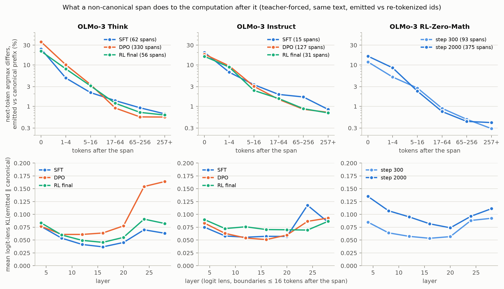
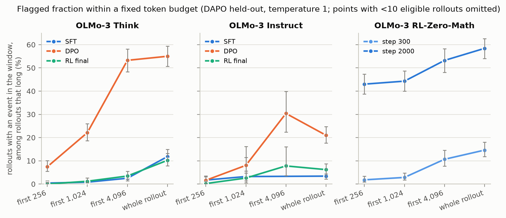
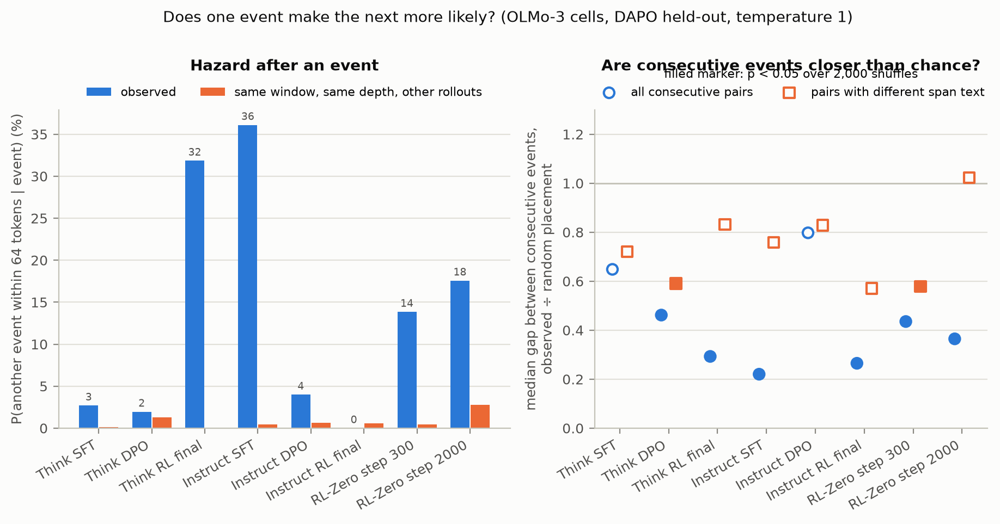

# How big of a problem are non-canonical tokens for interpretability research?

*Draft for the MATS application doc. Figures are produced by `scripts/figures.py` and the random examples by `scripts/random_examples.py`; every number is from the tables in `RESULTS.md`, which `scripts/check_results.py` regenerates from the stored rollouts. Items marked [todo] need Brendan's input.*

## Executive summary

**The problem.** A language model can emit a token sequence whose decoded text re-tokenizes differently: `light` + `house` where the tokenizer would produce `l` + `ighthouse`. I call these non-canonical tokens. They are invisible in any transcript stored as text, so a probe, logit lens or attribution run on the re-tokenized text is looking at positions the model never computed. Non-canonical inputs are also a known jailbreak vector, which makes me worry about models reasoning in tokens a text-based monitor cannot see. I wanted to know how often modern models do this on ordinary tasks, which post-training stage moves the rate, and what a non-canonical span does to the computation after it.

**What I did.** I sampled 500 held-out DAPO math problems (plus AIME 2024/2025) from every released post-training checkpoint of OLMo-3-7B Think and Instruct (SFT, DPO, RL), from four steps of OLMo-3-7B-RL-Zero-Math (RL straight from the base model), and from the Tulu-3-8B ladder as a second tokenizer. I kept the emitted token ids and checked each rollout with `encode(decode(ids)) != ids`. The primary statistic is the fraction of rollouts with at least one non-canonical event; 12 checkpoints, two sampling settings, about 55 million generated tokens.

**High-level takeaways.**

- Every checkpoint does this. The shipped OLMo-3 Think model has at least one non-canonical span in 10% of math rollouts at temperature 1 and 2% at its recommended settings (rollouts average about 9,000 tokens).
- **My pre-registered prediction was wrong.** I predicted SFT ≈ DPO < RL, because on-policy RL is the only stage whose loss is computed on the ids the model actually emitted. Instead DPO, which trains on canonical text, raised the flagged fraction 4.7× (Think: 12% → 55%) and 6.2× (Instruct: 3% → 21%), and on-policy RL brought it back down to the SFT level (10% and 6%). Figure 1.
- RL from the base model with no SFT goes the other way: RL-Zero-Math rises from 15% of rollouts at step 300 to 58% at step 2000, monotonically. Figure 2.
- Tulu-3, on the Llama tokenizer, shows no stage effect (3–5% throughout), so the DPO spike may be specific to the OLMo-3 tokenizer or recipe.
- This is not tail sampling. In the three cells with the most spans, about three quarters of spans begin with the model's argmax token (about half in Think-SFT and early RL-Zero); the recommended settings cut the rate 4–8× but Think-DPO still flags 15% of rollouts at temperature 0.6, top-p 0.95. Figure 3.
- The damage is local. Teacher-forcing the same text as emitted ids versus their canonical re-tokenization changes the next-token argmax at the span for between a tenth and a third of spans depending on the checkpoint, and the two distributions agree again within about 16 tokens. Figure 6. A re-tokenized transcript is wrong at the span, not for the rest of the rollout.
- Events cluster within rollouts, but in the on-policy RL checkpoints the "clustering" is the same span recurring (84% of consecutive events in Think RL final repeat the same text), which looks like a learned tokenization habit rather than a destabilized rollout. Figure 5.

**Figure 1.** Fraction of rollouts with at least one non-canonical event, by post-training stage, at temperature 1 / top-p 1 and at each checkpoint's recommended sampling settings. 500 rollouts per cell, Wilson 95% intervals. RL-Zero-Math and Think-SFT ship no recommended settings.

**Figure 6.** For each non-canonical span, two teacher-forced passes over the same text: the ids the model emitted, and the canonical re-tokenization of the same text from the span onward. Top: how often the next-token argmax differs, by distance after the span. Bottom: logit-lens KL by layer for positions within 16 tokens of the span.

## Randomly selected examples

Three events per cell drawn uniformly (seed 0) from every event the metric flagged, byte fragments included. `·` is a space. The full command is `scripts/random_examples.py`.

| cell | preceding text | emitted tokens | canonical tokens | position |
|---|---|---|---|--:|
| OLMo-3 Think-DPO | `…通常，如果没有队的情` | `�` | (incomplete UTF-8 bytes, no text form) | 170 |
| OLMo-3 Think-DPO | `…, the possible a's are integers such` | `isme` `aning` | `ism` `ean` `ing` | 1,420 |
| OLMo-3 Think-DPO | `…: 1 + (exponent of` | `·` `rd` | `·rd` | 909 |
| OLMo-3 Think RL final | `… wins by girls in those games, W` | `_g` `b` | `_gb` | 3,926 |
| OLMo-3 Think RL final | `…Therefore substituting into Area_octagon:⏎⏎` | `Area` `oct` | `Are` `ao` `ct` | 5,518 |
| OLMo-3 Think RL final | `… The image link is to a cdn` | `·art` `of` | `·ar` `to` `f` | 4,946 |
| OLMo-3 RL-Zero-Math step 2000 | `… tag, in` | `·$` `($` | `·$($` | 3 |
| OLMo-3 RL-Zero-Math step 2000 | `…}45= (2 + log_` | `3` `5` | `35` | 1,796 |
| OLMo-3 RL-Zero-Math step 2000 | `…E(50/17,10).⏎⏎` | `Point` `F` | `PointF` | 11,399 |
| OLMo-3 Instruct-DPO | `…) will rise from 0 up to` | `·half` `way` | `·halfway` | 13,165 |
| OLMo-3 Instruct-DPO | `…!}{11(10!+11` | `!)` `}\` `)` | `!` `)}` `\)` | 1,523 |
| OLMo-3 Instruct-DPO | `… out direction) and to \(A\)` | `·(` `_per` | `·(_` `per` | 529 |

Three things the sample shows that the tables do not. Most events are seams between ordinary tokens (`isme`+`aning`, `Area`+`oct`), which is what you would expect if the model is choosing a plausible segmentation of a rare word rather than doing anything strange. The RL-Zero model has a fixed habit at position 3 of nearly every rollout (` $`+`($`, 213 times in 500 rollouts), which is a single learned tokenization, not noise. And the OLMo-3 tokenizer has one-, two- and three-digit tokens, so digits can be non-canonical (`3`+`5` for `35`); this is the case that matters most for arithmetic probes.

## Background

**Definition.** A BPE tokenizer maps text to one canonical id sequence, but many id sequences decode to the same text. A generated sequence is non-canonical if `encode(decode(ids)) != ids`. Models are trained on canonical text during pretraining and SFT, so they mostly produce canonical output, but nothing forces them to, and every model I have tested does not at some rate.

**Why it matters for interpretability.** Transcripts are stored as text. Anything that re-tokenizes a transcript and runs the model on it (probes on stored rollouts, logit lens, attribution, most "read the CoT" pipelines with white-box components) is running on a different id sequence than the one the model produced. Whether that matters depends on how often it happens and how far the model's computation diverges afterwards, which are the two questions here.

**Why it matters for safety.** [Non-canonical input tokens evade some safety training](https://arxiv.org/abs/2503.02174). A model that reasons in non-canonical tokens is reasoning in a representation its text-based monitor does not see.

**Why I expected on-policy RL to raise the rate.** SFT and DPO compute their loss on stored text, which is canonical by construction. On-policy RL computes its loss on the ids the policy actually sampled, so a non-canonical sequence can be a reinforced target only during RL. My pre-registered prediction (`EXPERIMENT_PLAN.md`, predictions 3 and 4) was SFT ≈ DPO < RL.

**What the earlier project established.** This builds on [a 20-hour exploratory project](https://github.com/brendanlong/tokenization-hidden-computation-experiment) that measured rates across many models on short prompts: every model has a non-zero rate, in-distribution English is under 0.1% per token, and temperature and numerical precision both move the rate, so sampling settings and dtype must be pinned. That project was too broad; this one asks one question with matched checkpoints.

**Related work.** [Geh et al. 2024](https://arxiv.org/abs/2408.08541) study the distribution a base model induces over tokenizations of a string and report that unconditional samples from Llama-2-7B and Gemma-2B drift non-canonical at roughly 0.04–0.13% per token, mostly in non-English, code and unicode text. [Jain et al. 2026](https://arxiv.org/abs/2606.15521) study the input side on the OLMo-2 ladder: robustness to re-tokenized prompts improves over post-training. Neither measures output rates across post-training stages.

## Setup

**Models.** I chose families with public per-stage checkpoints from one base, one tokenizer and one training codebase, so adjacent checkpoints differ by exactly one stage.

| family | base | stages run | notes |
|---|---|---|---|
| OLMo-3-7B Think | Olmo-3-1025-7B | SFT → DPO → RL (final) | long CoT in `<think>`; SFT traces are re-tokenized DeepSeek R1 output |
| OLMo-3-7B Instruct | same | SFT → DPO → RL (final) | short answers, no think block |
| OLMo-3-7B RL-Zero-Math | same, no SFT | RL steps 300, 600, 1400, 2000 (final) [todo: 1000, 1800 pending] | RL directly on the base model |
| Tulu-3-8B | Llama-3.1-8B | SFT → DPO → RLVR (PPO); Tulu-3.1 (GRPO from the same DPO) | different tokenizer and a different DPO recipe |

**Prompts.** 500 problems from `open-r1/DAPO-Math-17k-Processed` (14,116 rows), filtered by normalized exact and 80-character-prefix match against the public OLMo-3 RL prompt sets (13,314 RL-Zero-Math prompts, 102,014 Think-RL prompts), which left 3,254 held-out problems; 500 were sampled with a fixed seed, one rollout each. AIME 2024 and 2025 (60 problems, 8 samples each) as a harder, decontaminated set for three checkpoints. Answers are integers, so correctness is a deterministic check on the boxed answer. One caveat: the held-out DAPO remainder is what AI2 did not select for RL and it skews easy (the Think ladder scores 97–99% on finished rollouts).

**Sampling.** vLLM 0.11, bf16 weights and KV cache, no speculative decoding, 32k-token cap, the model's default chat template. Two arms: temperature 1 / top-p 1, which measures what the model learned, and each checkpoint's `generation_config.json` (0.6 / 0.95 for OLMo-3, 0.6 / 0.9 for Tulu), which measures what a user sees. RL-Zero-Math ships no generation config. Emitted ids and top-10 logprobs are stored for every position.

**Metric.** Round-trip on the emitted ids. A minimal diff between the emitted and canonical sequences gives the non-canonical spans; an incomplete multi-byte character (a byte fragment the model started and never finished) counts as one event. The primary statistic is the fraction of rollouts with at least one event, with Wilson 95% intervals and Fisher exact tests between cells. Length control: the same flag restricted to the first L tokens among rollouts that reached L. I pre-registered the per-token rate, then demoted it on 2026-09-04 because events cluster within rollouts, so a per-token test overstates the evidence; it is still reported in `RESULTS.md`.

**Verification.** Every table in `RESULTS.md` is generated by a recorded command and checked against the stored rollouts by `scripts/check_results.py`. [todo: say what you read by hand: how many transcripts, what you were checking for, what you found.]

**Cost.** [todo: total from the RunPod bill.] Full runs on B200 at $6.79/h, the pilot on an A100-80GB at $1.39/h. Raw rollouts with ids and logprobs are on HuggingFace as `brendanlong/noncanonical-post-training`, so the analysis can be rerun without a GPU.

## Results

### 1. Post-training stage moves the rate, and not the way I predicted

Figure 1 is the main result. At temperature 1 on the held-out DAPO problems:

| family | SFT | DPO | RL final |
|---|--:|--:|--:|
| OLMo-3 Think | 11.8% | 55.0% | 10.2% |
| OLMo-3 Instruct | 3.4% | 21.0% | 6.2% |

In both OLMo-3 tracks the DPO checkpoint flags far more rollouts than the SFT checkpoint before it (Fisher p = 7e-50 and 1e-18), and the on-policy RL checkpoint flags far fewer than DPO (p = 1e-54 and 6e-12), ending level with SFT in Think (p = 0.48) and slightly above it in Instruct (p = 0.053). Mean rollout length barely changes across the Think ladder (8.2k, 8.2k, 9.3k tokens), so this is not a length effect; the Instruct SFT rollouts are much shorter (538 tokens versus 3.4k and 2.5k), which the length-controlled view below handles.

RL-Zero-Math, which starts from the base model with no SFT, rises across training: 14.6% at step 300, 14.6% at step 600, 28.8% at step 1400, 58.4% at step 2000 (Figure 2). Within the first 1,024 tokens the rise is 2.8% → 6.0% → 21.6% → 44.3%, so it is not the rollouts getting longer.

**Figure 2.** RL-Zero-Math over RL steps: fraction of rollouts with at least one event, whole rollout and within the first 1,024 tokens. [todo: steps 1000 and 1800 when they land.]

Tulu-3 does not move: 5.2%, 3.0%, 2.8%, 3.4% across SFT, DPO, RLVR and Tulu-3.1, with no pair significant and an omnibus chi-square p of 0.16. Its DPO stage is not the same recipe as OLMo-3's (length-normalized DPO on GPT-4o-judged pairs versus the Dolci preference mixture), and its tokenizer is different, so this is a weak replication test, but it says the DPO spike is not a universal property of DPO.

So predictions 3 and 4 were wrong. DPO, which never sees an emitted id, raised the rate; on-policy RL, the only stage that could reinforce a non-canonical sequence, lowered it. I discuss what might be going on below.

### 2. Most spans start at the argmax, and the recommended settings do not remove them

The obvious alternative explanation is that non-canonical tokens are tail samples that a sane top-p removes. The stored top-10 logprobs say otherwise (Figure 3). In the three cells with the most spans, the first token of the span was the model's argmax 76–80% of the time (Think-DPO 76%, Think RL final 80%, RL-Zero step 2000 79%), against 86–88% of all sampled tokens at rank 1. In Think-SFT and RL-Zero step 300 it is about half. Only 2–11% of spans start beyond the top 10.

**Figure 3.** Share of non-canonical spans by the rank of their first emitted token in the model's next-token distribution.

DPO's excess has a specific shape. 231 of its 403 spans begin with a bare space token emitted at probability near 1, followed by a token at rank >10 in 81% of cases (in this tokenizer a standalone space is canonical only before a digit, so the space is fine and the deviation is the token after it). Excluding those, DPO's argmax-start spans per million argmax samples are 26, versus 11 for SFT and 21 for RL final. Sharpness does not explain the ladder either: Think-SFT is the least sharp checkpoint by every measure (top-10 entropy 0.62 nats, 1.2% of samples beyond the top 10) and has the lowest tail-start span rate, while DPO is the sharpest (0.34 nats, 0.5%) and its beyond-top-10 samples are non-canonical 11× more often than SFT's.

The recommended settings lower every OLMo-3 cell by 3.6–8.5× (all p ≤ 7e-4) without changing the ordering: Think-DPO 55% → 15%, Think RL 10% → 2%, Instruct-DPO 21% → 5%, Instruct RL 6% → 1%. At those settings the model never samples beyond its top 10, so what survives is argmax and near-argmax spans.

### 3. Robustness: length, problem set, correctness

**Length.** Figure 4 restricts the flag to the first 256, 1,024 and 4,096 tokens among rollouts that reached that length. DPO and RL-Zero separate from the other checkpoints within the first 1,024 tokens (Think-DPO 22% versus 0.8% for SFT and 1.2% for RL final), so the whole-rollout gaps are not an artefact of length. The window has no power for the short Instruct-SFT cell (31 rollouts reach 1,024 tokens) or for Tulu, whose rollouts average about 1,000 tokens.

**Figure 4.** Flagged fraction within a fixed token budget, among rollouts at least that long. The whole-rollout point is over all 500 rollouts; the windows are over the subset that reached the window, which for Instruct is a shorter and harder subset.

**Problem set.** On AIME every checkpoint flags more rollouts than on DAPO (Think-DPO 69% vs 55%, RL final 23% vs 10%, RL-Zero 67% vs 58%; p ≤ 0.0045), and AIME rollouts are 1.8–2.1× longer. Within the first 1,024 tokens no checkpoint differs between the two sets (p ≥ 0.36). That is consistent with the difference being length, though the windows do not prove it. The stage ordering is the same on both sets.

**Correctness.** Restricting to rollouts with the correct answer leaves the ordering unchanged (Think 9.2% → 54.2% → 9.3%). I pre-registered that incorrect rollouts would have higher rates; the Think track has only 6–12 incorrect rollouts per cell, so that test is underpowered here, and the per-token rates by outcome go both ways in the cells that have enough (RL-Zero step 2000: 0.022% correct versus 0.033% incorrect). I am reporting this as "the ordering is robust to conditioning on correctness", not as a result on the prediction.

### 4. Does one event make the next more likely?

Events could cluster within rollouts because some rollouts are prone, or because an event raises the chance of the next one. Four measurements on the OLMo-3 cells (Figure 5):

- *Propensity.* The large cells have about as many rollouts with two or more events as a Poisson process at the cell's rate would give each rollout's length (Think-DPO 119 versus 118 expected, Instruct-DPO 37 versus 32) or fewer (RL-Zero step 2000, 88 versus 130). Events are not concentrated in prone rollouts beyond what length predicts.
- *Hazard.* The chance of another event within 64 tokens of an event exceeds the same window at the same depth in other rollouts in 11 of 12 cells, by a lot in the on-policy RL cells (Think RL final 32% versus 0.1%, RL-Zero step 2000 18% versus 3%) and by little in the DPO cells (Think-DPO 2.0% versus 1.3%).
- *Gaps.* Consecutive events sit closer together than the same number of events placed at random in the same rollout, in 9 of 12 cells.
- *Same text.* Restricting to consecutive events with different span text splits the story. In Think RL final, 84% of consecutive events repeat the same text, and among the rest the clustering disappears (p = 0.33); the same in RL-Zero step 2000 (41% repeats, p = 0.58). In Think-DPO it stays (median gap 1,019 versus 1,725 tokens, p < 0.0005; its 18% repeats are almost all repeated byte fragments).

**Figure 5.** Left: probability of another event within 64 tokens of an event, observed and at the same depth in other rollouts of the cell. Right: median gap between consecutive events divided by the median under random placement within the same rollout, for all pairs and for pairs whose span text differs. Filled markers are p < 0.05 over 2,000 shuffles.

So there are two answers. For the on-policy RL checkpoints, "contagion" is a learned tokenization repeating (the RL-Zero ` $`+`($` habit, `Rew` after a period in Think RL final), not a destabilized rollout. For Think-DPO, events of different text cluster beyond what its count and length predict, which is consistent with either a local state (a stretch of text where the tail is being sampled) or true contagion from the first event. The next section is the direct test of the latter. The hazard baseline controls for depth but not for prompt, and rests on few draws in the rare-event cells.

### 5. What a span does to the computation after it

For each span I ran two teacher-forced forward passes over the same text with the model's real prefix: the ids the model emitted, and the canonical re-tokenization from the span onward (spliced so that it matches the canonical tokenization of the whole text). At every byte boundary after the span that both tokenizations share I recorded the KL divergence between the two next-token distributions, whether the argmax differs, and the logit-lens KL and residual cosine distance at layers 4, 8, ..., 28. Up to 3 spans per rollout and 400 per cell; spans with another event inside the 512-token window were skipped so the divergence measured is the span's own. This is the full-prefix rerun; a first build that truncated the prefix gave numbers within a few points of these. [todo: confirm the rerun is what `RESULTS.md` shows when you submit.]

At the span's end the two distributions differ: the argmax differs for 36% of Think-DPO spans, 24% of Think-SFT, 21% of Think RL final, 16% of RL-Zero step 2000 and 16–20% on the Instruct ladder, with median KL between 0.004 and 0.26 nats across the OLMo-3 cells. The difference decays fast: 5–16 tokens after the span the argmax differs at 2–3% of boundaries, and from 17 tokens on at 0.3–1.9%, with median KL at or below 0.001 nats. In the logit lens near the span the KL has no consistent middle-layer peak: it is largest at layers 24–28 in five of the eight cells and at layer 4 in the other three. Beyond the span the two sequences also differ in position index (the canonical span usually has a different token count), which likely sets the small far-field floor.

For the interpretability question this is the number that matters. A probe or logit lens run on a re-tokenized transcript sees the wrong distribution at the span, in a tenth to a third of cases a different argmax, and is back in agreement within about 16 tokens. The damage is local to the span. Combined with the rates above, the shipped Think model at its recommended settings has a span in 2% of 9,000-token rollouts, so per-position exposure is tiny; at a DPO checkpoint or an RL-Zero model it is not.

## What I think is going on

The pre-registered mechanism (on-policy RL releases the canonicalizing pressure of text training) predicts the RL-Zero curve and nothing else. Candidate explanations for the rest, and what would separate them:

1. **On-policy RL from an SFT model canonicalizes rather than releases.** The sampled ids are overwhelmingly canonical, and reinforcing sampled sequences sharpens the model onto its own canonical habits. RL from the base model has no such prior and drifts, and the drift is monotone in steps. This is the reverse of my mechanism and fits both OLMo-3 tracks and RL-Zero. Test: an RL run from the DPO checkpoint with intermediate checkpoints (the Think RL branches have 55) should show the rate falling over steps, not just at the endpoint.
2. **DPO teaches a tokenizer-specific bare-space habit.** Over half of DPO's spans are a standalone space at probability near 1 followed by a tail token, and this tokenizer makes a standalone space canonical only before a digit. Something in the preference data or the DPO objective is putting mass on that space. Test: look for the pattern in the chosen and rejected completions of the DPO mixture; check whether the DPO rate changes with a tokenizer that has space-prefixed digit tokens (Tulu's does not show the spike).
3. **Training amount.** With quality held roughly equal, more training lowers the rate. This fits Think RL > DPO > SFT in total steps but not the DPO spike above SFT or RL-Zero rising.
4. **Tokenizer.** Tulu-3 is flat. One more family with per-stage checkpoints on a third tokenizer would say whether the DPO effect is an OLMo-3 quirk.

## Limitations

- **One tokenizer family carries the DPO result.** Tulu-3 does not replicate it, and its DPO recipe differs, so I cannot separate tokenizer from recipe.
- **Cost.** 7B models, 500 rollouts per cell, one sample per problem. Larger models may behave differently.
- **Model selection.** Only a few families release per-stage checkpoints, and the models most relevant to the frontier are API-only or too expensive to sample.
- **Task.** Everything is math with verifiable answers. The held-out DAPO set skews easy. Chat prompts would need a coherence judge I did not have time to build.
- **Sampling arms.** The recommended settings change temperature and top-p together, so their separate contributions are not measured.
- **AIME.** 8 samples per problem with within-problem correlation, so its intervals are somewhat narrow.
- **Correct versus incorrect** is underpowered in the Think track.
- **Clustering baselines** control for depth but not for prompt.
- **RL-Zero curve** [todo: has four points; six when steps 1000 and 1800 land].

## Time spent and AI use

[todo: Brendan's numbers.] I spent about 8 hours directly on this project. It builds on the earlier exploratory project, which took about 20 hours at the keyboard; what carried over is the round-trip metric, the finding that temperature and dtype must be pinned, and the token-class slices. All code, prompt sets and models here are new. Neel's rules allow a timer reset for a total change of direction; this is partial, so I am reporting both numbers.

Claude Code agents wrote most of the code and ran the experiments from my plan and pre-registered predictions; I reviewed the design decisions recorded in `EXPERIMENT_PLAN.md` and `RESULTS.md`, changed the primary metric after the first cells came in, and rejected the first divergence build for using a truncated prefix. [todo: what you verified by hand, e.g. which transcripts you read and what you were looking for.]

## Code

[github.com/brendanlong/noncanonical-post-training](https://github.com/brendanlong/noncanonical-post-training). `EXPERIMENT_PLAN.md` has the design, predictions and amendments in order; `RESULTS.md` has every run with its command and numbers; `scripts/check_results.py` regenerates the summary tables from the stored rollouts; `scripts/figures.py` produces the figures here. Rollouts with ids and logprobs are on HuggingFace as `brendanlong/noncanonical-post-training`.
