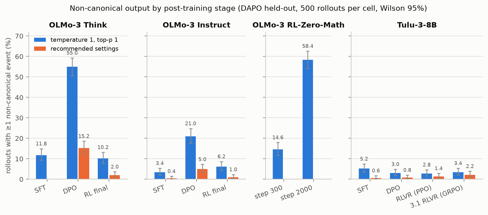
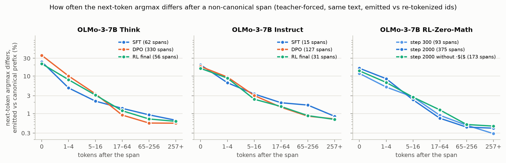
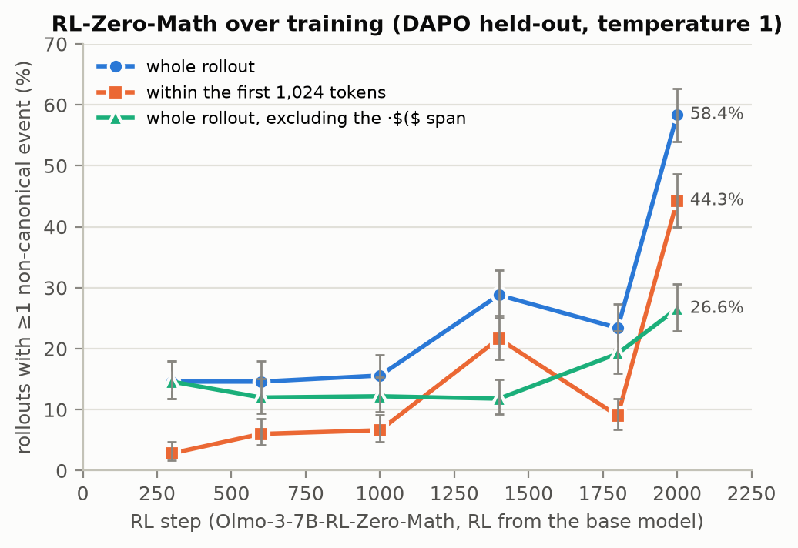
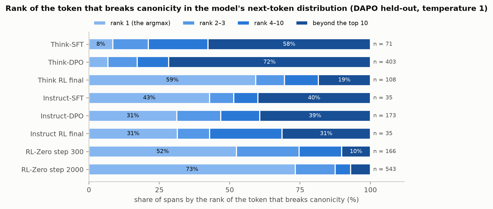

# How big of a problem are non-canonical tokens for interpretability research?

*Draft for the MATS application doc, to be rewritten in Brendan's voice. Figures come from `scripts/figures.py`, the examples from `scripts/random_examples.py`, the composition table from `scripts/flag_composition.py`. Every number is from a generated table in `RESULTS.md` (all 17 blocks verified by `scripts/check_results.py` on 2026-09-04) or from `figures/data.json`, which the figure script writes from the same metrics. `[todo]` marks what needs Brendan.*

## Executive summary

A language model can emit a token sequence whose decoded text re-tokenizes differently: `light` + `house` where the tokenizer would produce `l` + `ighthouse`. These non-canonical tokens are invisible in a transcript stored as text, so a probe or logit lens run on the re-tokenized text is looking at positions the model never computed, and non-canonical inputs are a known jailbreak vector. I wanted to know how often modern models do this, which post-training stage moves the rate, and how far the computation diverges afterwards.

I sampled 500 held-out DAPO math problems (and AIME 2024/2025 for three checkpoints) from every post-training checkpoint of OLMo-3-7B Think and Instruct (SFT, DPO, RL), from six RL steps of OLMo-3-7B RL-Zero-Math (RL directly on the base model), and from the Tulu-3-8B ladder as a second tokenizer: 16 checkpoints, 75 million generated tokens, emitted ids kept and checked by `encode(decode(ids)) != ids`. The statistic is the fraction of rollouts with at least one non-canonical event (a span or an unfinished multi-byte character).

**The answer.** For a shipped model it is a small problem: the OLMo-3-7B Think release has an event in 2% of its 9,000-token math rollouts at its recommended sampling settings, and 10% at temperature 1. For intermediate checkpoints it is not: the DPO checkpoint before it has one in 15% of rollouts at recommended settings and 55% at temperature 1. When an event happens the damage is local: teacher-forcing the same text as the emitted ids versus their canonical re-tokenization changes the next-token argmax at the span for 12–36% of spans and the two distributions agree again within about 16 tokens (Figure 4).

**My pre-registered prediction was wrong.** I predicted SFT ≈ DPO < RL, because on-policy RL is the only stage whose loss is computed on the ids the model actually emitted. Instead DPO, which trains on canonical text, raised the flagged fraction from 12% to 55% (Think) and 3% to 21% (Instruct), and on-policy RL brought it back to 10% and 6% (Figure 1). More than half of DPO's excess in Think is a standalone space (canonical only before a digit) followed by a tail token, and the same checkpoint code-switches into Chinese ten times more than its neighbours; excluding that shape and byte fragments, DPO still flags 23% of rollouts against 10% for SFT and RL.

**RL from the base model goes the other way, mostly through one habit.** RL-Zero-Math is flat at 15% of rollouts from step 300 to 1000, then 29%, 23% and 58% at steps 1400, 1800 and 2000. The swings are one learned span at the start of the rollout (` $`+`($` for ` $($`), in 99, 27 and 210 rollouts at those steps. Without it: 12–15% through step 1400, then 19% and 27%.

**Tulu-3-8B does not move** (3–5% at every stage), so the DPO spike may be an OLMo-3 quirk. **Two mechanisms.** Ranked at the token that breaks canonicity, SFT's and DPO's spans are tail samples (58% and 72% beyond the top 10) while on-policy RL's are the model's first choice (59% at the argmax for Think RL final, 73% for RL-Zero), so the recommended settings remove most of DPO's spans and few of RL-Zero's.

**Figure 1.** Rollouts with a non-canonical event within the first 256, 1,024 or 4,096 tokens, among rollouts at least that long, by post-training stage. DAPO held-out, temperature 1 / top-p 1, Wilson 95% intervals. Instruct-SFT's 1,024 bar is 1 of 31 rollouts.

**Figure 4.** Same text, two id sequences: emitted versus canonical from the span on. How often the next-token argmax differs, by distance after the span.

## Sanity check: uniformly sampled events

Three events per cell drawn uniformly (seed 0) from every event the metric flagged, byte fragments included, not curated. `·` is a space, `⏎` a newline.

| cell | preceding text | emitted tokens | canonical tokens | position |
|---|---|---|---|--:|
| OLMo-3-7B Think-DPO | `…通常，如果没有队的情` | `�` | (incomplete UTF-8 bytes, no text form) | 170 |
| OLMo-3-7B Think-DPO | `…, the possible a's are integers such` | `isme` `aning` | `ism` `ean` `ing` | 1,420 |
| OLMo-3-7B Think-DPO | `…: 1 + (exponent of` | `·` `rd` | `·rd` | 909 |
| OLMo-3-7B Think RL final | `… wins by girls in those games, W` | `_g` `b` | `_gb` | 3,926 |
| OLMo-3-7B Think RL final | `…Therefore substituting into Area_octagon:⏎⏎` | `Area` `oct` | `Are` `ao` `ct` | 5,518 |
| OLMo-3-7B Think RL final | `… The image link is to a cdn` | `·art` `of` | `·ar` `to` `f` | 4,946 |
| OLMo-3-7B RL-Zero-Math step 2000 | `… tag, in` | `·$` `($` | `·$($` | 3 |
| OLMo-3-7B RL-Zero-Math step 2000 | `…}45= (2 + log_` | `3` `5` | `35` | 1,796 |
| OLMo-3-7B RL-Zero-Math step 2000 | `…E(50/17,10).⏎⏎` | `Point` `F` | `PointF` | 11,399 |
| OLMo-3-7B Instruct-DPO | `…) will rise from 0 up to` | `·half` `way` | `·halfway` | 13,165 |
| OLMo-3-7B Instruct-DPO | `…!}{11(10!+11` | `!)` `}\` `)` | `!` `)}` `\)` | 1,523 |
| OLMo-3-7B Instruct-DPO | `… out direction) and to \(A\)` | `·(` `_per` | `·(_` `per` | 529 |

Most events are seams between ordinary tokens (`isme`+`aning`, `Area`+`oct`): the model picked a plausible segmentation of an uncommon word rather than sampling from the deep tail. The RL-Zero row at position 3 is the ` $($` habit discussed above. The OLMo-3 tokenizer has one-, two- and three-digit tokens, so digits can be non-canonical (`3`+`5` for `35`), which is the case that matters most for arithmetic probes. The Think-DPO byte fragment sits in a stretch of Chinese; DPO's byte fragments are mostly like that.

## Background

A BPE tokenizer maps text to one canonical id sequence, but many id sequences decode to the same text. A generated sequence is non-canonical if `encode(decode(ids)) != ids`. Pretraining and SFT only ever show the model canonical text, so it mostly produces canonical output, but nothing forces it to, and every model I have tested goes non-canonical at some rate.

Transcripts are stored as text. Anything that re-tokenizes a transcript and runs the model on it (probes on stored rollouts, logit lens, attribution, any CoT-reading pipeline with a white-box component) is running on a different id sequence than the one the model produced. Whether that matters depends on how often it happens and how far the computation diverges afterwards. On the safety side, [non-canonical input tokens evade some safety training](https://arxiv.org/abs/2503.02174), and a model that reasons in non-canonical tokens is reasoning in a representation its text-based monitor does not see.

I expected on-policy RL to raise the rate. SFT and DPO compute their loss on stored text, which is canonical by construction. On-policy RL computes its loss on the ids the policy actually sampled, so a non-canonical sequence can be a reinforced target only during RL. My pre-registered predictions (`EXPERIMENT_PLAN.md`, 3 and 4) were SFT ≈ DPO < RL, with a smaller effect for Instruct because its RL run is short.

This builds on [a 20-hour exploratory project](https://github.com/brendanlong/tokenization-hidden-computation-experiment) that measured rates across many models on short prompts: every model has a non-zero rate, in-distribution English is under 0.1% per token, and temperature and numerical precision both move the rate, so sampling settings and dtype must be pinned. That project was too broad; this one asks one question with matched checkpoints. Two related papers: [Geh et al. 2024](https://arxiv.org/abs/2408.08541) study the distribution a base model induces over tokenizations of a string and find that unconditional samples from Llama-2-7B and Gemma-2B drift non-canonical at roughly 0.04–0.13% per token, mostly in non-English, code and unicode text; [Jain et al. 2026](https://arxiv.org/abs/2606.15521) study the input side on the OLMo-2 ladder and find robustness to re-tokenized prompts improves over post-training. Neither measures output rates across post-training stages.

## Setup

I chose families with public per-stage checkpoints from one base, one tokenizer and one training codebase, so adjacent checkpoints differ by exactly one stage.

| family | base | stages run | notes |
|---|---|---|---|
| OLMo-3-7B Think | Olmo-3-1025-7B | SFT → DPO → RL (final) | long CoT in `<think>`; SFT traces are re-tokenized DeepSeek R1 output |
| OLMo-3-7B Instruct | same | SFT → DPO → RL (final) | short answers, no think block |
| OLMo-3-7B RL-Zero-Math | same, no SFT | RL steps 300, 600, 1000, 1400, 1800, 2000 (final) | RL directly on the base model; the chat template injects a fixed "solve step by step" instruction |
| Tulu-3-8B | Llama-3.1-8B | SFT → DPO → RLVR (PPO); Tulu-3.1 (GRPO from the same DPO) | different tokenizer and a different DPO recipe |

Prompts are 500 problems from `open-r1/DAPO-Math-17k-Processed` (14,116 rows), filtered by normalized exact and 80-character-prefix match against the public OLMo-3 RL prompt sets (13,314 RL-Zero-Math prompts, 102,014 Think-RL prompts), which left 3,254 held-out problems; 500 were sampled with a fixed seed, one rollout each. AIME 2024 and 2025 (60 problems, 8 samples each) is a harder, decontaminated set run for three checkpoints. Answers are integers, so correctness is a deterministic check on the boxed answer. The held-out DAPO remainder is what AI2 did not select for RL and it skews easy: the Think ladder scores 97–99% on finished rollouts, while Instruct-SFT answers only 133 of 500 correctly and 85 do not parse.

Generation is vLLM 0.11, bf16 weights and KV cache, no speculative decoding, a 32k-token cap, and the model's default chat template. Two sampling arms: temperature 1 / top-p 1, which measures what the model learned, and each checkpoint's `generation_config.json` (0.6 / 0.95 for OLMo-3, 0.6 / 0.9 for Tulu), which measures what a user sees. RL-Zero-Math ships no generation config and Think-SFT was run at temperature 1 only. Emitted ids and top-10 logprobs are stored for every position.

The metric is the round-trip on the emitted ids. A minimal diff between the emitted and canonical sequences gives the non-canonical spans; an incomplete multi-byte character (a byte fragment the model started and never finished) counts as one event. The primary statistic is the fraction of rollouts with at least one event, with Wilson 95% intervals and Fisher exact tests between cells. Length control is the same flag restricted to the first L tokens among rollouts that reached L. I pre-registered the per-token rate and demoted it on 2026-09-04 because events cluster within rollouts, so a per-token test overstates the evidence; it is still in `RESULTS.md`. With 37 cell pairs and up to four tests each, a few p-values near 0.05 are expected by chance; the effects I lean on are at p < 1e-10.

Every table in `RESULTS.md` is generated by a recorded command and checked against the stored rollouts by `scripts/check_results.py`. [todo: what you read by hand: how many transcripts, what you were checking for, what you found.] [todo: total cost from the RunPod bill.] Full runs were on B200 at $6.79/h, the pilot on an A100-80GB at $1.39/h. Rollouts with ids and logprobs are on HuggingFace as `brendanlong/noncanonical-post-training`, so the analysis reruns without a GPU.

## Results

### 1. Post-training stage moves the rate, and not the way I predicted

Figure 1 is the main result, length-matched. On whole rollouts at temperature 1 on the held-out DAPO problems:

| family | SFT | DPO | RL final |
|---|--:|--:|--:|
| OLMo-3-7B Think | 11.8% | 55.0% | 10.2% |
| OLMo-3-7B Instruct | 3.4% | 21.0% | 6.2% |

In both tracks the DPO checkpoint flags far more rollouts than the SFT checkpoint before it (Fisher p = 7e-50 and 1e-18), and the on-policy RL checkpoint flags far fewer than DPO (p = 1e-54 and 6e-12), ending level with SFT in Think (p = 0.48) and slightly above it in Instruct (p = 0.053). Mean rollout length barely changes across the Think ladder (8.2k, 8.2k, 9.3k tokens), so this is not a length effect there. Instruct-SFT is a different case: its rollouts are short (538 tokens against 3.4k and 2.5k) and it mostly fails the task, so the Instruct SFT→DPO comparison is between a model that answers and one that does not, and the length-matched view cannot separate that gap from length.

**What the flagged fraction is made of.** The headline numbers are dominated by span classes that deserve to be named (`scripts/flag_composition.py`; a bare-space span is a standalone whitespace token followed by the deviation, which in this tokenizer is canonical only before a digit):

| cell | flagged | events: fragment / bare-space / other | excluding fragments and bare-space | also excluding the most common span text |
|---|--:|---|--:|--:|
| Think-SFT | 11.8% | 3 / 6 / 65 | 10.2% | 10.0% |
| Think-DPO | 55.0% | 107 / 231 / 172 | 23.4% | 23.2% |
| Think RL final | 10.2% | 5 / 1 / 107 | 9.6% | 9.4% |
| RL-Zero step 2000 | 58.4% | 3 / 2 / 541 | 58.0% | 26.0% (` $($`, 210 rollouts) |
| Instruct-SFT | 3.4% | 2 / 2 / 33 | 3.0% | 2.8% |
| Instruct-DPO | 21.0% | 5 / 5 / 168 | 20.6% | 20.6% |
| Instruct RL final | 6.2% | 1 / 2 / 33 | 5.6% | 5.4% |

Think-DPO's 55% is 231 bare-space spans and 107 byte fragments on top of 172 ordinary spans; SFT and RL final have 6 and 1 bare-space spans. Excluding both classes the DPO spike is 2.3× rather than 4.7×, still at p < 1e-6, and the ordering is unchanged. Instruct-DPO's 21% is ordinary spans. Both the bare-space habit and the ordinary-span increase appear at DPO and disappear at RL, so they are both DPO effects, but they should be counted separately, and the mechanism discussion below treats them separately.

RL-Zero-Math is flat from step 300 to 1000 (14.6%, 14.6%, 15.6%), then 28.8% at step 1400, 23.4% at 1800 and 58.4% at 2000 (Figure 2). Accuracy (87–92%) and mean length (5,400–6,350 tokens) do not move. The non-monotone part is one learned span: ` $`+`($` at the third token of the rollout, where the model opens its first display equation right after the template's instruction, in 16, 17, 99, 27 and 210 rollouts at steps 600 to 2000. With that span removed the fractions are 14.6%, 12.0%, 12.2%, 11.8%, 19.2% and 26.6%, and within the first 256 tokens 0.6–2.2% at every checkpoint. So the run has two things going on. One is a habit for one LaTeX opener whose frequency swings between checkpoints (emitted as the model's first choice: 73% of RL-Zero's breaking tokens are the argmax at step 2000). The other is a rise from 12% to 27% of rollouts in the last 600 steps that is not length (median rollout length stays at 5,100–5,500 tokens) and not the opening: split by depth, non-habit events per million tokens stay at 20–50 in the first 1,024 tokens at every checkpoint, and roughly triple past 1,024 tokens between steps 1400 and 2000 (Figure 2, right; 8–60 events per point). The later text is the model's own mid-solution reasoning, where the word-plus-variable joins live (` than`+`k`, ` when`+`g`). I do not know what drives it. A finer checkpoint ladder around steps 1400–2000 would say whether the opener habit tracks something in the training data or reward; the released checkpoints cannot.

**Figure 2.** RL-Zero-Math over RL steps. Left: rollouts with at least one event, whole rollout and within the first 1,024 tokens. Middle: the same with the ` $($` span excluded. Right: non-habit events per million tokens by depth in the rollout (8–60 events per point, so read the shape, not the wiggles).

Tulu-3 does not move on whole rollouts: 5.2%, 3.0%, 2.8%, 3.4% across SFT, DPO, RLVR and Tulu-3.1, no pair significant, omnibus chi-square p = 0.16. Within the first 1,024 tokens its omnibus is p = 1e-06, which is Tulu-3-SFT's word-salad rollouts (13.2% of the 106 rollouts that reach 1,024 tokens, against ≤ 3.6% for the other stages). Tulu's DPO is not the same recipe as OLMo-3's (length-normalized DPO on GPT-4o-judged pairs versus the Dolci preference mixture) and its tokenizer is different, so this is a weak replication test, but it says the DPO spike is not a universal property of DPO.

So predictions 3 and 4 were wrong. DPO, which never sees an emitted id, raised the rate; on-policy RL, the only stage that could reinforce a non-canonical sequence, lowered it from an SFT starting point and raised it from a base-model starting point.

### 2. Tail samples in SFT and DPO, argmax habits under on-policy RL

The obvious alternative explanation is that non-canonical tokens are tail samples that a sane top-p removes. The stored top-10 logprobs give a two-part answer (Figure 3). The first token of a span is usually a legitimate prefix (a bare space before a digit, ` light` before `house`), and it is the model's argmax 76–80% of the time in the cells with the most spans. The decision that makes the string non-canonical is the token after it, the first emitted token after which the tokens so far no longer re-encode to themselves; it is the second token of the span in 86–100% of spans in every cell. Ranked at that token, the ladders separate. Think-SFT's and Think-DPO's spans are tail samples: 58% and 72% of breaking tokens come from beyond the top 10 and only 8% and 7% are the argmax. Think RL final's are argmax choices (59% at rank 1, 19% beyond the top 10), and RL-Zero's are argmax choices at every checkpoint (52% at step 300, 73% at step 2000). The Instruct ladder is mixed and Tulu-3-SFT's spans are tail samples (81% beyond the top 10).

**Figure 3.** Share of non-canonical spans by the rank, in the model's next-token distribution, of the token that breaks canonicity.

The examples in `RESULTS.md` show what the two kinds look like. A tail sample is Think-DPO emitting ` `+`^` at p = 0.001 where `20` had 0.43. An argmax habit is Think RL final emitting `_g`+`b` at p = 1.000 three times in one rollout, or RL-Zero emitting `3`+`5` for `35` at p = 1.000: the prefix token committed the model and the breaking token was forced. This is the pattern I pre-registered for the two mechanisms (argmax spans should rise with on-policy RL, tail spans should track DPO), and the first-token ranks I looked at first did not show it.

It also explains the sampling-settings result. The recommended settings lower every OLMo-3 cell by 3.6–8.5× (all p ≤ 7e-4) without changing the ordering: Think-DPO 55% → 15%, Think RL 10% → 2%, Instruct-DPO 21% → 5%, Instruct RL 6% → 1%. Cutting the tail removes DPO's tail-sampled spans (its remaining spans sit at ranks 1–3) and cannot remove a span the model emits as its first choice, which is why RL-Zero, sampled as it was trained, keeps its 58%.

### 3. Robustness: length, problem set, correctness

Figure 1 restricts the flag to the first 256, 1,024 and 4,096 tokens among rollouts that reached that length. Think-DPO and RL-Zero separate from the other checkpoints within the first 1,024 tokens (Think-DPO 22% against 0.8% for SFT and 1.2% for RL final), so those gaps are not an artefact of length. The window has no power for Instruct-SFT (31 rollouts reach 1,024 tokens) or for Tulu, whose rollouts average about 1,000 tokens; each window is over the subset of rollouts that reached it, which for Instruct is a shorter and harder subset.

On AIME every checkpoint flags more rollouts than on DAPO (Think-DPO 69% against 55%, RL final 23% against 10%, RL-Zero 67% against 58%; p ≤ 0.0045), and AIME rollouts are 1.8–2.1× longer. Within the first 1,024 tokens no checkpoint differs between the two sets (p ≥ 0.36). That is consistent with the difference being length, though the windows do not prove it. The stage ordering is the same on both sets.

Restricting to rollouts with the correct answer leaves the ordering unchanged (Think 9.2% → 54.2% → 9.3%). I pre-registered that incorrect rollouts would have higher rates; the Think track has only 6–12 incorrect rollouts per cell, so that test is underpowered here, and the per-token rates by outcome go both ways in the cells that have enough (RL-Zero step 2000: 0.022% correct against 0.033% incorrect). I am reporting this as "the ordering is robust to conditioning on correctness", not as a result on the prediction.

### 4. What a span does to the computation after it

For each span I ran two teacher-forced forward passes over the same text with the model's real prefix. Sequence A is the ids the model emitted. Sequence B is identical up to the span and continues with the canonical re-tokenization of the text from the span on, spliced so that it matches the canonical tokenization of the whole text. The two sequences usually have different lengths after the span (`Are`+`ao`+`ct` is three tokens where `Area`+`oct` was two), so positions are compared at byte boundaries both tokenizations share: the end of the span, and every later token boundary that exists in both. At each shared boundary I recorded the KL divergence between the two next-token distributions, whether the argmax differs, and the logit-lens KL and residual cosine distance at layers 4, 8, ..., 28. Up to 3 spans per rollout and 400 per cell; spans with another event inside the 512-token window were skipped so the divergence measured is the span's own. Beyond the span the sequences also differ in position index, which sets a small floor far from the span. A first build that truncated the prefix to 4,096 tokens gave the same numbers on the large cells and up to 11 points lower argmax disagreement on the 13–15-span Instruct-SFT cell; the numbers here are the full-prefix rerun. 

At the span's end the two distributions differ: the argmax differs for 36% of Think-DPO spans, 24% of Think-SFT, 21% of Think RL final, 16% of RL-Zero step 2000 and 16–20% on the Instruct ladder, with median KL between 0.004 and 0.26 nats across the OLMo-3 cells. RL-Zero's measured spans are 202 of 375 the ` $($` opener; it flips the next argmax 18% of the time and the other spans 14%, so the line is not an artefact of the habit (Figure 4, right). The difference decays fast: 5–16 tokens after the span the argmax differs at 2–3.4% of boundaries, and from 17 tokens on at 0.3–1.9%, with median KL at or below 0.001 nats. The logit lens by layer (in `RESULTS.md`) shows no consistent middle-layer peak: the KL is largest at layers 24–28 in five of the eight cells and at layer 4 in the other three.

What a flip looks like, from the randomly drawn flipping spans in `RESULTS.md` (top predictions after the emitted span versus after the canonical re-tokenization of the same text):

| cell | context | span: emitted → canonical | after the emitted span | after the canonical span |
|---|---|---|---|---|
| Think-DPO | `…quadrilateral with a` | ` "`+`-establish` → ` "-`+`establish` | `ment` 0.45, `ing` 0.35 | `ed` 0.98 |
| Think-DPO | `…(ab + ac + bc)(abc) =` | ` `+`_count` → ` _`+`count` | `_` 0.28, ` that` 0.16 | ` that` 0.80 |
| Think-DPO | `…After 6, 12, 20, 30, 42... 24` | ` isn`+`typedef` → ` isnt`+`yp`+`edef` | `?` 0.21, `s` 0.18 | `initely` 0.75 |

These are the cases a transcript-based tool gets wrong: the model that produced the text was about to write `isn` `typedef` `?` while the re-tokenized transcript says it was about to write `isntypedefinitely`.

A probe or logit lens run on a re-tokenized transcript therefore sees the wrong distribution at the span, in a tenth to a third of cases a different argmax, and is back in agreement within about 16 tokens. Combined with the rates above, the shipped Think model at its recommended settings has an event in 2% of 9,000-token rollouts, so per-position exposure is tiny; at a DPO checkpoint or an RL-Zero model it is not.

## What I think is going on

The pre-registered mechanism (on-policy RL releases the canonicalizing pressure of text training) predicts the RL-Zero curve and nothing else. Candidate explanations for the rest, and what would separate them:

1. **On-policy RL from an SFT model canonicalizes rather than releases, and what survives it is habit, not noise.** The sampled ids are overwhelmingly canonical, and reinforcing sampled sequences sharpens the model onto its own canonical habits; the spans that remain after RL are emitted as the model's first choice, not sampled from the tail. RL from the base model has no such prior, and what it reinforces includes its own non-canonical habits (the ` $($` opening is the clearest case: reinforced because it starts correct answers, not because of its tokenization). Test: the Think RL run has 55 intermediate checkpoints; the rate should fall over steps from the DPO starting point.
2. **DPO changes the tail after a bare space, not the space, and code-switches into Chinese.** The three Think checkpoints emit the bare-space token at the same rate (42–43 per 1,000 tokens) and expect a digit after it 99% of the time on every checkpoint. What DPO changes is what comes out when the next token is not a digit: 231 whitespace-first spans against 6 for SFT and 1 for RL final, whose second tokens are byte fragments and CJK characters (32) and otherwise punctuation and word pieces. The same checkpoint has 591 CJK characters per 100k in 152 of 500 rollouts, against 46 for SFT and 18 for RL final. Think-SFT's traces are re-tokenized DeepSeek-R1 reasoning, which is known to mix Chinese into English chains; DPO on preferences over such traces could amplify it and the verifiable-reward RL after it prunes it. Test: whether the Dolci-Think-DPO chosen responses contain more CJK than the rejected ones. The 2.3× rise in ordinary spans still needs its own explanation.
3. **Training amount.** With quality held roughly equal, more training lowers the rate. This fits Think RL > DPO > SFT in total steps but not the DPO spike above SFT or RL-Zero rising.
4. **Tokenizer.** Tulu-3 is flat. One more family with per-stage checkpoints on a third tokenizer would say whether the DPO effect is an OLMo-3 quirk.

## Limitations

- **One tokenizer family carries the DPO result.** Tulu-3 does not replicate it, and its DPO recipe differs, so tokenizer and recipe are confounded.
- **Two span classes carry the two largest numbers.** Think-DPO's 55% is over half bare-space spans and byte fragments; RL-Zero's 58% is over half one recurring span. The decomposed numbers are in section 1 and should be read alongside the headline ones.
- **Cost.** 7B models, 500 rollouts per cell, one sample per problem. Larger models may behave differently.
- **Model selection.** Few families release per-stage checkpoints, and the models most relevant to the frontier are API-only or too expensive to sample.
- **Task.** Everything is math with verifiable answers. The held-out DAPO set skews easy. Chat prompts would need a coherence judge I did not have time to build.
- **Instruct-SFT** mostly fails the task, so its comparison with Instruct-DPO is confounded by competence and length.
- **Sampling arms.** The recommended settings change temperature and top-p together, so their separate contributions are not measured.
- **AIME** is 8 samples per problem with within-problem correlation, so its intervals are somewhat narrow.
- **Correct versus incorrect** is underpowered in the Think track.
- **Divergence** was measured on the eight OLMo-3 cells; the Tulu cells have 13–22 spans each and are not shown.
- **RL-Zero curve** has six checkpoints from one run; the opener habit swings between them, so the shape between checkpoints is unknown.

## Time spent and AI use

[todo: Brendan's numbers.] I spent about 8 hours directly on this project. It builds on the earlier exploratory project, which took about 20 hours at the keyboard; what carried over is the round-trip metric, the finding that temperature and dtype must be pinned, and the token-class slices. All code, prompt sets and models here are new. Neel's rules allow a timer reset for a total change of direction; this is partial, so I am reporting both numbers.

Claude Code agents wrote most of the code and ran the experiments from my plan and pre-registered predictions; I reviewed the design decisions recorded in `EXPERIMENT_PLAN.md` and `RESULTS.md`, changed the primary metric after the first cells came in, and rejected the first divergence build for using a truncated prefix. [todo: what you verified by hand.]

## Code

[github.com/brendanlong/noncanonical-post-training](https://github.com/brendanlong/noncanonical-post-training). `EXPERIMENT_PLAN.md` has the design, predictions and amendments in order; `RESULTS.md` has every run with its command and numbers; `scripts/check_results.py` regenerates the summary tables from the stored rollouts; `scripts/figures.py`, `scripts/random_examples.py` and `scripts/flag_composition.py` produce everything shown here; the clustering and contagion analyses left out of this draft are in `RESULTS.md` under "Follow-ups". Rollouts with ids and logprobs are on HuggingFace as `brendanlong/noncanonical-post-training`.
